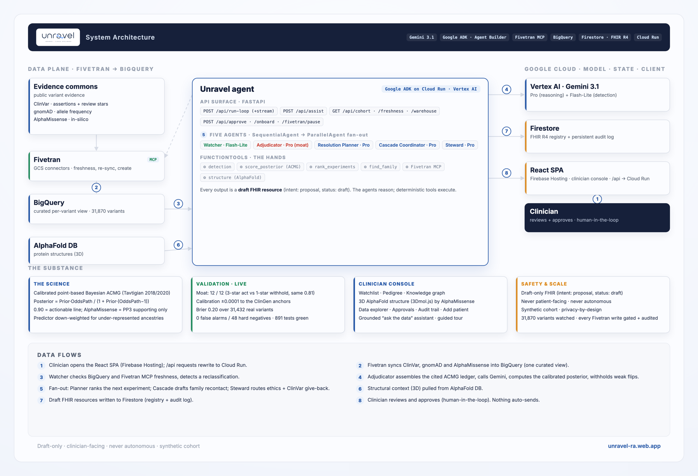

<p align="center">
  
</p>

# Unravel

**Closing the one diagnostic loop in medicine that stays open for *years*, for the patient *and* their family.**

Five Gemini 3.1 agents in a Google ADK (Agent Builder) flow that watch evolving variant evidence synced via the **Fivetran MCP** and, the moment a **Variant of Uncertain Significance (VUS)** is reclassified, recompute a calibrated ACMG posterior and draft the patient recontact + family cascade no system sends today. Draft-only, FHIR R4, human-in-the-loop.

Built for the **Google Cloud Rapid Agent Hackathon** · **Fivetran track**.

- **Live demo (no login):** https://unravel-ra.web.app · **API:** https://unravel-api-306681961993.us-central1.run.app
- **3-minute video:** _coming soon_
- **Powered by** Gemini 3.1 (Pro + Flash-Lite) · Google ADK / Agent Builder · Cloud Run · Fivetran MCP · BigQuery · Firestore (FHIR R4) · AlphaFold + AlphaMissense

---

## The problem

A VUS means the lab cannot yet call a variant benign or dangerous, so clinically nothing is done, *"if it ever changes, we'll let you know."* But the evidence moves: a real fraction of VUS reclassify over 18 months to 5+ years, and no system re-reads them on the patient's behalf. By the time a dangerous variant flips, the proband may be in remission or deceased; and because germline variants are heritable, the life now at risk is a **relative's**, cascade testing never offered. The duty to recontact is, in ACMG's own words, *"desirable but not currently feasible."* Unravel is the active layer that closes that loop, **cascade-first** and **disease-agnostic**. *(The full story, and Diane's case, is on the [mission page](https://unravel-ra.web.app/mission).)*

---

## Quickstart

> Requires a Google Cloud project (Vertex AI, Cloud Run, BigQuery, Firestore, Secret Manager) and a Fivetran account.

```bash
# Backend: ADK agents + API (Python 3.12)
cd backend
python3.12 -m venv .venv && source .venv/bin/activate
pip install -r requirements.txt
cp .env.example .env                            # set GOOGLE_CLOUD_PROJECT
PYTHONPATH=. python scripts/seed_registry.py    # seed the FHIR cohort into Firestore
PYTHONPATH=. python -m pytest tests/ -q         # 891 cases, all green
PYTHONPATH=. uvicorn server:app --reload --port 8000

# Frontend: React + Vite SPA (proxies /api to :8000)
cd ../frontend && npm install && npm run dev
```

Open **http://localhost:5173/app**, pick a flagged patient, run the watch loop. `PYTHONPATH=.` is required so the `unravel` package imports. Deploy: containerise `backend/` to Cloud Run; `npm run build` to Firebase Hosting.

---

## Architecture

<p align="center"></p>

Public evidence is staged in GCS and synced by Fivetran into a curated BigQuery view. The five-agent system (`SequentialAgent` root: Watcher → Adjudicator → `ParallelAgent` fan-out of Planner ‖ Cascade ‖ Steward, one shared Session) reads that view, drives the Fivetran MCP for freshness, calls Vertex AI Gemini for the judgement, pulls AlphaFold structures, and writes draft FHIR to Firestore. The React SPA on Firebase Hosting rewrites `/api` to Cloud Run (same-origin). A clinician approves; nothing auto-sends.

- **Models:** `gemini-3.1-flash-lite` (high-frequency delta detection); `gemini-3.1-pro-preview` (adjudication, planning, drafting).
- **Partner superpower (deep MCP):** the loop weaves *multiple* Fivetran MCP operations into its reasoning, freshness checks and targeted re-syncs mid-loop, plus on-demand connector creation, not a single token call.
- **Clinical seam (FHIR R4):** fires when external *evidence* changes (not when the EHR pushes a result), reads the FHIR patient registry, and writes **drafts back** (`intent: proposal`). HL7 Genomics Reporting IG, no EHR modification.
- **Console (React/Vite):** tabbed views, Watchlist, Pedigree, Knowledge graph, Data explorer (Fivetran control plane), Approvals, Audit trail, Add patient, plus a grounded "ask the data" assistant and a guided tour.

---

## The five agents

Five real Gemini `LlmAgent`s in a genuine ADK multi-agent flow (`backend/unravel/agents.py`). Each reads prior agents' outputs from shared state and calls deterministic **FunctionTools** for the auditable work, the brain/hands split.

| Agent | Model | Tools | Job |
|---|---|---|---|
| **1. Watcher** | Flash-Lite | `lookup_reclassification`, `check_feed_freshness` | Triage the detected change; can check Fivetran freshness. |
| **2. Adjudicator** | 3.1 Pro | `assemble_evidence` | Weigh the cited ACMG ledger + calibrated posterior against review quality, and **withhold** low-confidence flips. *The moat.* |
| **3. Resolution Planner** | 3.1 Pro | `rank_next_experiments` | Recommend the single highest-yield next experiment, in ACMG currency. |
| **4. Cascade Coordinator** | 3.1 Pro | `find_family` | On an actionable verdict, draft clinician-facing recontact for carriers + at-risk relatives as draft FHIR. |
| **5. Steward** | 3.1 Pro | `steward_assessment` | Route deceased-proband cases to an ethics pathway (never a letter); draft a ClinVar give-back. |

*Why an agent system, not a cron job:* detecting a status flip is deterministic (a tool); the judgement is agentic, ClinVar carries conflicting submissions at different star levels, and correctly **withholding** a 1-star flip while acting on a 3-star one at the *same* molecular posterior is genuine reasoning a threshold cannot do.

---

## Hackathon requirements (Rapid Agent · Fivetran track)

| Requirement | How Unravel meets it |
|---|---|
| **Fivetran destination** | Three **GCS → BigQuery** connectors land ClinVar, gnomAD and AlphaMissense; a curated view (`backend/sql/variant_evidence.sql`) models them into the AI data plane the agents query. A custom **Connector SDK** connector is deployed live too. |
| **Fivetran MCP server** (hard requirement) | The official `fivetran-mcp` server is baked into the Cloud Run image and driven live: freshness (`get_connection_state`) before each adjudication, targeted re-syncs (`sync_connection`), pause/resume (`modify_connection`), and on-demand connector **creation** (`create_connection`) for gene onboarding. `backend/unravel/fivetran_mcp.py`. |
| **Google Cloud AI** | Gemini 3.1 Pro + Flash-Lite (Vertex AI), orchestrated as a five-agent **Google ADK (Agent Builder)** system. `backend/unravel/agents.py`. |
| **End-to-end** | Fivetran MCP → BigQuery → five ADK agents (freshness-checked) → draft FHIR clinical action, all on the live dashboard. |
| **Human-in-the-loop** | Every clinical output is a **draft** FHIR resource a clinician approves; every Fivetran write is gated behind an explicit in-app approval and logged. |
| **Agent CRUD on Fivetran** | The Data explorer is a live control plane: list, health-check, pause, resume, sync, create connectors. |
| **Reproducibility** | `backend/scripts/setup_fivetran.py` recreates the connectors via the MCP; `sql/variant_evidence.sql` recreates the view. |
| **Working deployment** | Live at **unravel-ra.web.app** (SPA) + Cloud Run API. |

---

## The calibrated Bayesian model

The posterior is the published, point-based Bayesian formulation of the ACMG/AMP guidelines (Tavtigian 2018/2020), in `backend/unravel/acmg.py`, not a confidence we invented:

```
OddsPath  = 350 ^ (points / 8)
Posterior = (Prior x OddsPath) / (1 + Prior x (OddsPath - 1))     # Prior = 0.10
```

Summing signed ACMG points and applying the formula reproduces the ClinGen anchor probabilities to within **0.0001** (verified by `backend/eval/calibration.py`):

| ACMG points | Band | Posterior |
|---|---|---|
| 0 | (prior) | 0.10 |
| +6 | **Likely pathogenic** (actionable line) | 0.90 |
| +10 | **Pathogenic** | 0.994 |
| −7 | **Benign** | ~0.001 |

**Evidence mapping.** gnomAD allele frequency → `PM2` / `BS1` / `BA1`. AlphaMissense → `PP3` / `BP4` at the ClinGen-recommended calibrated strength (Pejaver 2022), capped as supporting evidence, never the classifier, and **down-weighted a tier for carriers of under-represented ancestries** to mitigate predictor bias (Pathak 2024; Livesey & Marsh 2024). The ClinVar assertion is deliberately **not** minted into points (avoids the discredited PP5/BP6 double-count); its review status travels as context, the seam where the 1-star withhold lives. Family evidence (`PP1`, `PS3`) comes from the FHIR registry.

> References: Richards 2015; Tavtigian 2018, 2020; Pejaver 2022, Bergquist 2025; Thompson 2014. Full bibliography in the submission writeup.

---

## Evaluation

The genuine test is the AI's judgement, not the deterministic plumbing, so that is the headline.

- **The agentic moat, live model** (`backend/eval/adjudicator_eval.py`): with the molecular posterior held **identical (0.81)**, the Gemini 3.1 Pro Adjudicator scored **12 / 12** across 8 genes, acting on every 3-star expert escalation, **withholding on every 1-star conflicting one at the same posterior**, reassuring on every benign downgrade. (Given the clinical principle, not the per-case answer, so it measures generalising judgement.)
- **Calibration:** reproduces the ClinGen anchors to **0.0001**. A check over **31,432 real Lynch variants** shows computational evidence alone is insufficient to classify (Brier 0.20), exactly why AlphaMissense is capped as supporting.
- **Scale + safety** (600-patient synthetic FHIR cohort carrying variants with real ClinVar reclassification history, 16 genes): **0** false alarms on **48** hard negatives (text changes, not category), withhold-recall **1.0** on the 1-star traps, zero dangerous escalations, and a **pytest suite of 74 functions / 891 cases, all green**.

> The headline (the live Adjudicator's judgement, calibration on 31,432 real variants) is independent and non-trivial; the deterministic steps are validated as correctness checks. Synthetic patients carrying real variants: a research prototype, rigorously evaluated, not yet clinically validated.

---

## Safety

- **Draft-only, clinician-facing, never patient-facing, never autonomous.** The line is *notification, not action*.
- **Asymmetric by design:** actionable upgrades surfaced loudly, common VUS→benign downgrades handled as quiet reassurance. Provenance is first-class (a single-submitter assertion is never a ClinGen expert panel).
- **Privacy by design:** synthetic data only, so no PHI is processed; compliance-ready, not "compliant" (an audited status we do not claim). Predictor bias is disclosed and contained, not claimed fixed.

---

## Data sources

- **Evidence (real, public):** ClinVar (assertions + review stars), gnomAD v4 (allele frequency), AlphaMissense (in-silico missense), AlphaFold (structures). Onboarded genes are served from the Fivetran-synced warehouse; any other gene resolves live from the public commons (Ensembl VEP + gnomAD + ClinVar), so the system is disease-agnostic.
- **Patients (synthetic):** a demo cohort of five carriers with real pedigrees (Diane Marchetti, MLH1 c.114C>G, a genuine reclassification; Mei Tanaka, same variant, ancestry-equity arm; a 1-star "trap"; a benign downgrade; a deceased-proband ethics case). No real patient data is used.

---

## Repository layout

```
backend/
  unravel/    the engine: acmg (Bayesian posterior), evidence (ledger) + live_evidence
              (disease-agnostic public-API fallback), detection, registry (FHIR + Firestore),
              adjudicator (Gemini), planner, cascade, steward, structure (AlphaFold),
              fivetran_mcp, onboarding (gene promotion), audit (persistent log),
              assistant (read-only grounded explainer, Flash), watch (orchestration)
  connectors/ a custom Fivetran Connector SDK connector (gnomAD), deployed live
  scripts/    data extractors, registry seeder, Fivetran setup + MCP smoke test
  sql/        the unified BigQuery evidence view
  tests/      pytest suite (74 functions, 891 cases, all green)
  server.py   FastAPI: /api/cohort, /run-loop (+stream), /pedigree, /graph, /patient,
              /structural, /freshness, /resync, /fivetran/pause, /warehouse,
              /onboard (+status), /audit, /approve, /assist
frontend/
  src/pages/  landing, technology, mission, app dashboard (Watchlist, Explorer,
              Approvals, Audit views)
  src/dash/   graph view, pedigree view, structure viewer, add-patient form,
              assistant widget (ask the data), guided tour
  src/api.ts  typed API client
```

---

## Built with (compliance)

Per the hackathon's required-products rule, Unravel is built entirely on **Google Cloud AI** (Gemini, Google ADK / Agent Builder, Vertex AI, Cloud Run, BigQuery, Firestore, Secret Manager, Firebase Hosting) and the **Fivetran** partner's MCP server. No competing cloud or AI services are used.

## License

[Apache-2.0](./LICENSE). Open source and free for commercial use.
